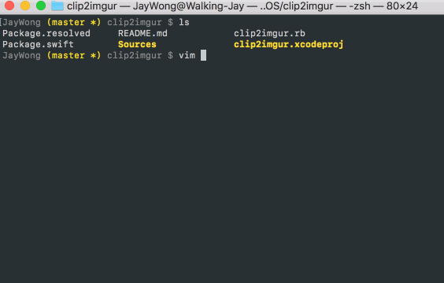

# clip2imgur
> A simple macOS command line tool for uploading your copied image to Imgur. 

[](https://travis-ci.org/xiaohk/clip2imgur)
<a href="https://swift.org/package-manager/"></a>

## Usage

Press <kbd>control+shift+command+3</kbd> or <kbd>control+shift+command+4</kbd> to capture and copy a screenshot. Run `imgur2clip` in your terminal, then boom, the image URL is in your clipboard.

If it is your first time to run `imgur2clip`, you can choose to authorize this tool, and your image will be posted in your image collection (`username.imgur.com/all`). You also can choose to post anonymously, but it is hard to get the url later and Imgur might delete your posts.

In default setting, the URL of posted image will be copied to your clipboard. You can use flags to configure it. 

```
$ clip2imgur --html
$ clip2imgur -n
```

| short | long | description |
|:--|:--|:--|
| `-m` | `--markdown` | URL will be copied in the Markdown image format.`[](https://i.imgur.com/x.png)` |
| `-t` | `--html` | URL will be copied in the HTML image format.``|
| `-n` | `--notcopy` | Your image URL will not be copied to your clipboard |

Personally I really like to include images in Markdown file using the HTML format, which gives me more control of the display. If you forget these flags, you always can run `clip2imgur -h` to check the usage.

## Install

This package is built using cross-platform Swift with Swift Package Manager (SPM), but it currently only supports macOS. There are three ways to install `clip2imgur`.

### Homebrew
Using `Homebrew` is the recommended and also the easiest way to get `clip2imgur` installed on your mac. If you don't have `Homebrew` installed, you can simply run:

```
$ /usr/bin/ruby -e "$(curl -fsSL https://raw.githubusercontent.com/Homebrew/install/master/install)"
```

Then, to install `clip2imgur`:

```
$ brew tap xiaohk/clip2imgur
$ brew install clip2imgur
```

### Download the Binary
You also can download the pre-compiled binary from the [Latest Rease](https://github.com/xiaohk/clip2imgur/releases/latest). After extract the binary, you want to put it in somewhere you won't accidentally remove later. Then you'd like to create a symbolic link in `/usr/local/bin` to launch `clip2imgur` in your terminal more quickly.

### Build from Source
This approach is not recommended, because I didn't open source a function to refresh your authorization for security reasons. Your compiled version works fine, but may require you to re-authorize `clip2imgur` periodically. If you only want to post images anonymously, then it doesn't really matter.

To build `clip2imgur`, you need macOS 10.10 or later and Swift 3.0 or above.

```
$ git clone https://github.com/xiaohk/clip2imgur.git
$ cd clip2imgur
$ swift build -c release -Xswiftc -static-stdlib
$ ln -s $(pwd)/.build/release/clip2imgur /usr/local/bin/clip2imgur
```

`clip2imgur` also has a by-product framework `clip2imgurCore` in `./build`. There might be some handy functions to use in your own projects.

## Built With
- [Swift Package Manager](https://swift.org/package-manager/)
- [Rainbow](https://github.com/onevcat/Rainbow)


